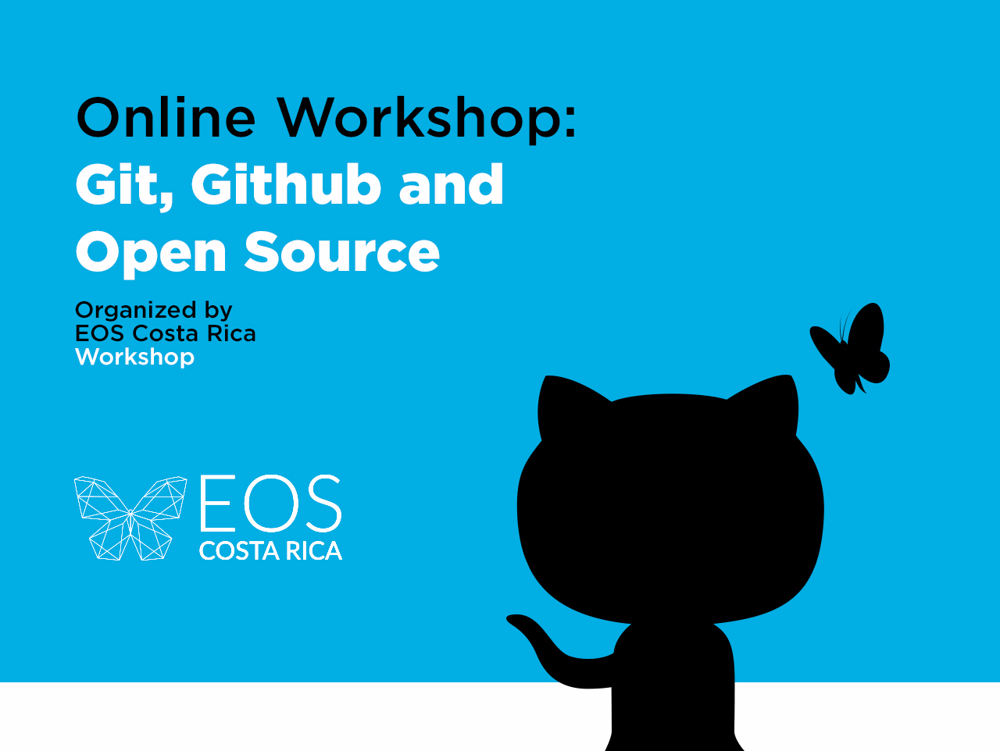

	
	
	
	
	
	
	

	

# Git, Github and Open Source Workshop Website

A site for the Git, Github and Open Source Workshop by @eoscostarica.

[git-workshop.eoscostarica.io](https://git-workshop.eoscostarica.io)

	

The purpose of this website and repository is to be provide a way to teach the basics of git and collaboration on github in life project.

It is list of attendants to workshop. Attendants will learn how to make, review and approve pull request by requesting to add their profile to list through a pull request.  

This free online workshop open to anyone how want to learn more about version control with git, best practices and open source. You will learn how to use git through the command line, how to take advantage of all the github features, modern software development workflows and how to collaborate in open source projects and more importantly why.

## Workshop Contents

- Why Git.
- Why Open Source.
- The Mind Shift:
	- From scarcity to abundance.
	- From competition to collaboration.
- Open Source Etiquette.
- Git and Github basics.
- Git Workflows and Automation.
- Kanban on Github.

**Requirements**

- A Github account (https://github.com).
- If you are on windows install git for windows (https://gitforwindows.org).
- If you in Mac or Linux, make sure you have git installed ( https://git-scm.com/book/en/v2/Getting-Started-Installing-Git ).
- Good internet connection.
- Good vibes.

**Instructor:**

Gabo Esquivel, OSS Lead at EOS Costa Rica

Gabo is a proponent of open source technology stacks and decentralized applications (DApps). He believes that blockchain will have a cornerstone role in our society to build better, more efficient, fair, accountable and transparent organizations, communities and economies. He leads software engineering teams and also loves coding, particularly in JavaScript (Node.js, React) and more recently smart contracts. He co-founded BlockchainCR, a community hub for knowledge sharing, promoting and studying blockchain technologies. He is an EOS enthusiast and open source contributor to EOS Costa Rica. Gabo is a tech events organizers and community builder, he founded and leads the largest tech meetups in Central America focusing in JavaScript (1700+ members), DevOps (600+ members) and Blockchain (800+ members), he has more than 6 years of experience organizing meetups and workshops.

[github](https://github.com/gaboesquivel) | [twitter](https://twitter.com/gaboesquivel) | [linkedin](https://linkedin.com/in/gaboesquivel) | [website](https://gaboesquivel.com)

## About EOS Costa Rica

EOS Blockchain is aiming to become a decentralized operating system which can support large-scale decentralized applications.

EOS Costa Rica supports the global and local open source efforts and development communities by maintaining and contribute to open source initiatives, meetups and workshops.

We challenge ourselves to provide the EOS platform with a strong geographical and political diversity by running the most robust EOS Block Producer possible from Costa Rica; We pledge to leverage our talent, experience, and sustainable internet resources to meet such an important challenge.

[eoscostarica.io](https://eoscostarica.io)

## License

MIT © [EOS Costa Rica](https://eoscostarica.io)  
